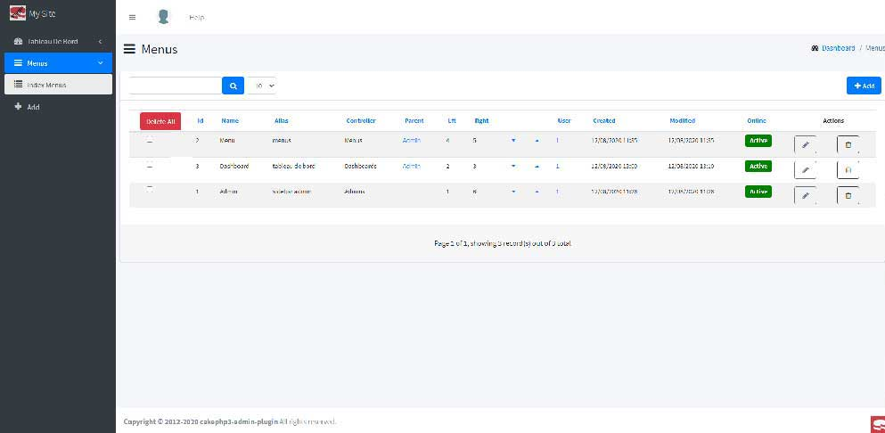
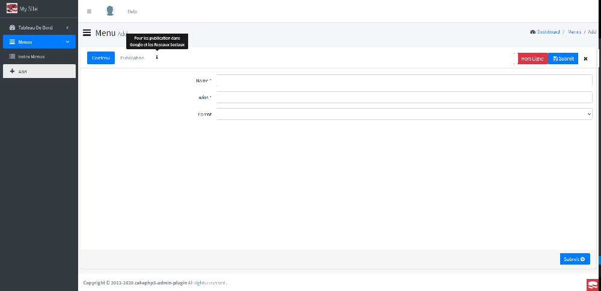
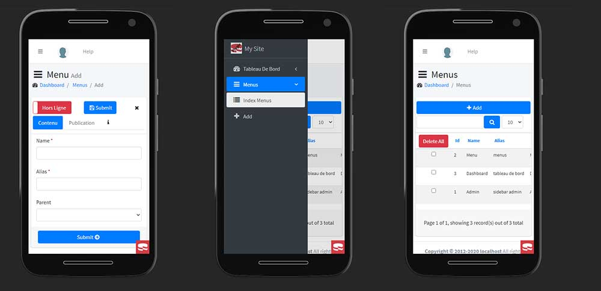

# Admin plugin for CakePHP

## Installation
You can install this plugin into your CakePHP application using [composer](https://getcomposer.org).

The recommended way to install composer packages is:
```bash
composer require --dev atelfoto/template-admin
```
### Enable Plugin

```php
// src/Application.php

public function bootstrap()
{
    $this->addPlugin('Admin');
}
```
Or Execute the following line in your shell command bash!
```
bin/cake plugin load Admin
```

### Enable prefix admin

```php
//config/routes

Router::prefix('admin', function ($routes)
{
    $routes->connect('/', ['controller' => 'Dashboards', 'action' => 'index']);
    $routes->fallbacks(DashedRoute::class);
});
```

### Enable Theme and Layout
```php
// src/controller/AppController.php

public function beforeFilter(Event $event)
    {
        if (!is_null($this->request->getParam('prefix'))) {
            $prefix = explode('/', $this->request->getParam('prefix'))[0];

            switch ($prefix) {
                case 'admin':
                    $this->viewBuilder()->setLayout('admin');
                    $this->viewBuilder()->setTheme('Admin');
                    break;
            }
        }
    }
```
### Enable View

```php
// src/View/AppView.php

public function initialize()
    {
        $this->loadHelper('Form', [
            'templates' => 'Admin.form-template',
        ]);
    }
```
### Configure

add this line
```
// config/bootstrap.php

Configure::load('Admin.config-dist', 'default', false);
```

below this line

```
Configure::load('app', 'default', false);
```
### Bake

#### Migrate Tables

```bash
bin/cake migrations migrate -p Admin
bin/cake migrations seed -p Admin

```
Or for each seed
```bake
bin/cake migrations seed --seed UsersSeed -p Admin
bin/cake migrations seed --seed HelpsSeed -p Admin
bin/cake migrations seed --seed MenusSeed -p Admin

```

Copy this Model

```bash
cp -R vendor/atelfoto/template-admin/src/Model/* src/Model/
```
And this Controller

```bash
cp -r vendor/atelfoto/template-admin/src/Controller/Admin/* src/Controller/Admin/
```

### Models

#### model examples

```bash
bin/cake bake model examples
```

### Controllers


#### Controller Examples

```bash
// ex. Examples for actions and prefix admin (with fields name:string and online:boolean ).

bin/cake bake controller Examples --actions index,view,add,edit,delete,deleteAll,online, --prefix admin -t Admin
```
For a Table with behavior Tree add moveUp and moveUp in --actions
```
bin/cake bake controller Examples --actions index,view,add,edit,delete,deleteAll,moveUp,moveDown,online, --prefix admin -t Admin
```


In controller/Admin/ExamplesController.php in the actions Add and edit change this line
```php
$parentMenus = $this->Examples->ParentMenus->find('list', ['limit' => 200]);
```
for this
```php
$parentMenus = $this->Menus->ParentMenus->find(
            'treeList',
            [
                'spacer' => "---- ",
            ]
        );
```
## Templates

#### Template Examples

```
bin/cake bake template Examples --prefix admin -t Admin
```
For Table with behavior Tree  delete this lines.
```php
//template/Admin/Examples/add.ctp
//and
//template/Admin/examples/edit.ctp
echo $this->Form->control('controller');
echo $this->Form->control('online');
```
and this line

```php
//Template/Admin/Menus/index.ctp

<td><?= h($menu->online); ?></td>
```


## Behavior Sluggable

In a Table and the function initialize add this line.
```bash
$this->addBehavior('Admin.Sluggable');
```
___







